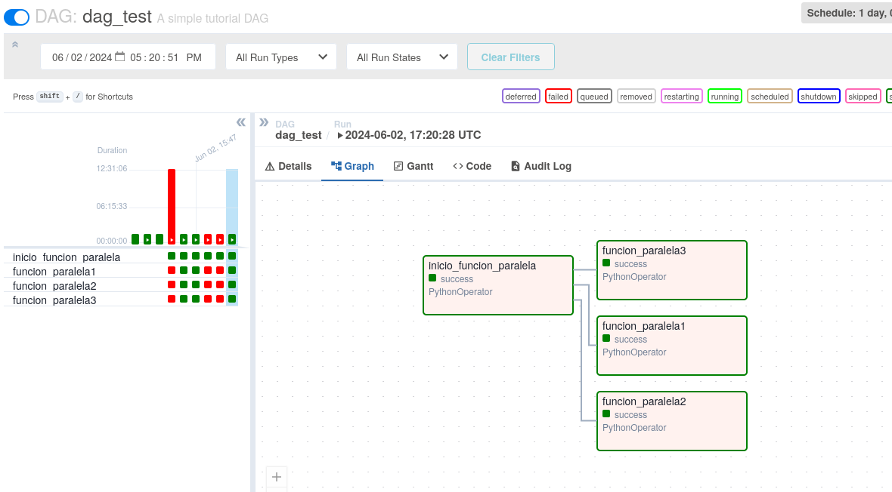

# Airflow Task Paralelismo DAGS

- dags.py continene la configuracion de los dags
- etl.py contiene la logica del paralelimo y la transformacion de datos
- query_sql se le agrega una funcion para funcionar con etl.py y no de errores en airflow

- Se cambio el archivo query_sql y se ingresaron los datos de la base de datos en vez de .ini a un diccionario de python

- Se incluye el requirements.txt por si hay errores entre versiones

